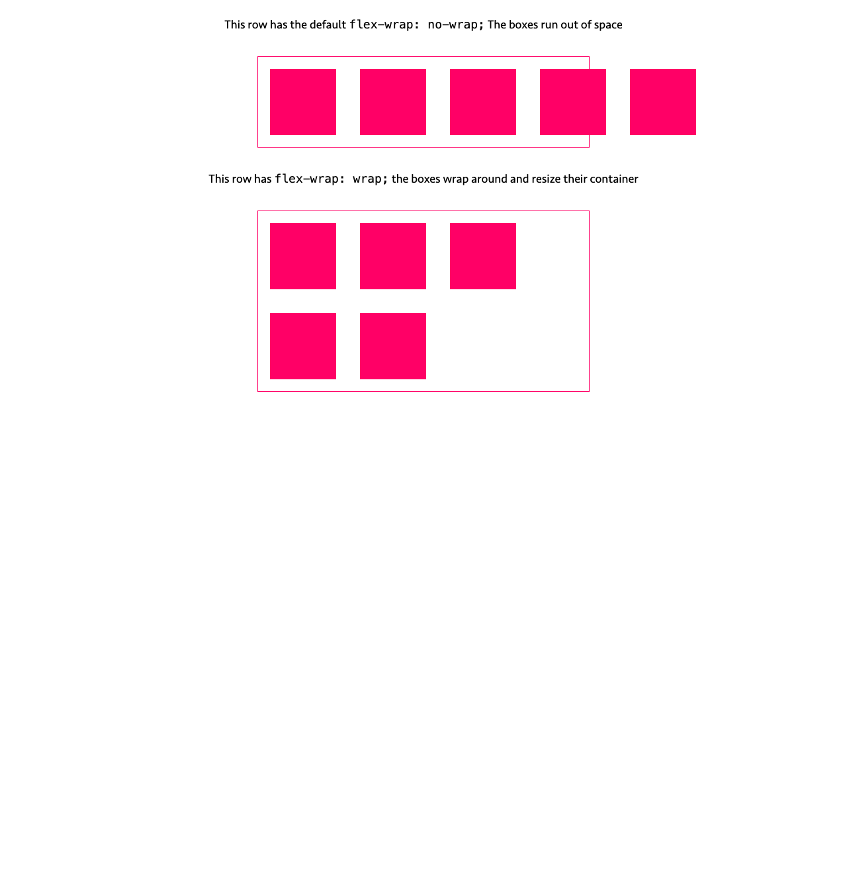

# Flexbox wrap

Test the flex-wrap: wrpa property. This property is used to wrap the flex items when the flex container is not wide enough to accommodate all flex items in a single line. The flex-wrap property accepts the following values:

