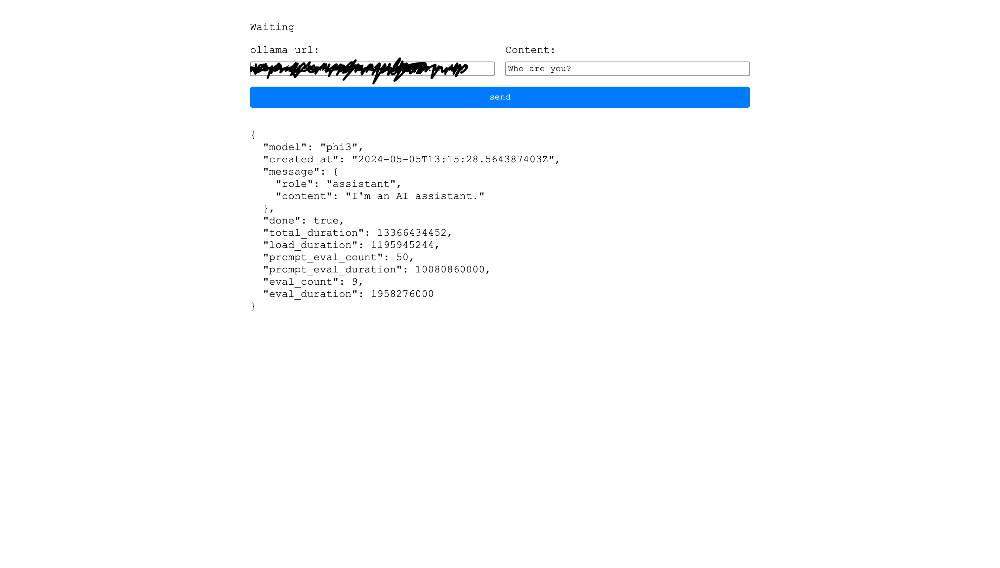

# Vanilla Ollama Client

## AI generated Description

The provided JavaScript code adds an event listener to an element with the ID `send`. Upon clicking the "send" button, it initiates an asynchronous `main` function. This function performs several actions:

1. **Spin Loading Animation:** It controls a loading spinner animation by periodically updating a spinner element (`spinner`) with different characters from an array (`spinnerData.frames`) to simulate an animation. This animation runs at intervals defined by `spinnerData.interval`.

2. **Input Validation:** It checks if the inputs from elements with the IDs `url` and `content` are not empty, displaying an alert if either is empty, thus stopping further execution.

3. **API Request:** If input validation passes, it constructs and sends an asynchronous POST request to a URL derived from the `url` input field, appending `/api/chat` to it. The request carries a JSON payload that includes a `stream` boolean, a `model` string identifier, and a `messages` array containing predefined content along with the user-provided content.

4. **Response Handling:** After sending the request, it stops the spinner animation and updates the loading message. The function then checks the HTTP response status. If the request is unsuccessful, it logs the response text and throws an error. If successful, it parses the JSON response and updates the inner text of a specified element (`#target>pre>code`) with the formatted JSON data.

The code makes use of modern JavaScript features such as async/await for asynchronous functions, template literals for string concatenation, and the Fetch API for sending network requests.
