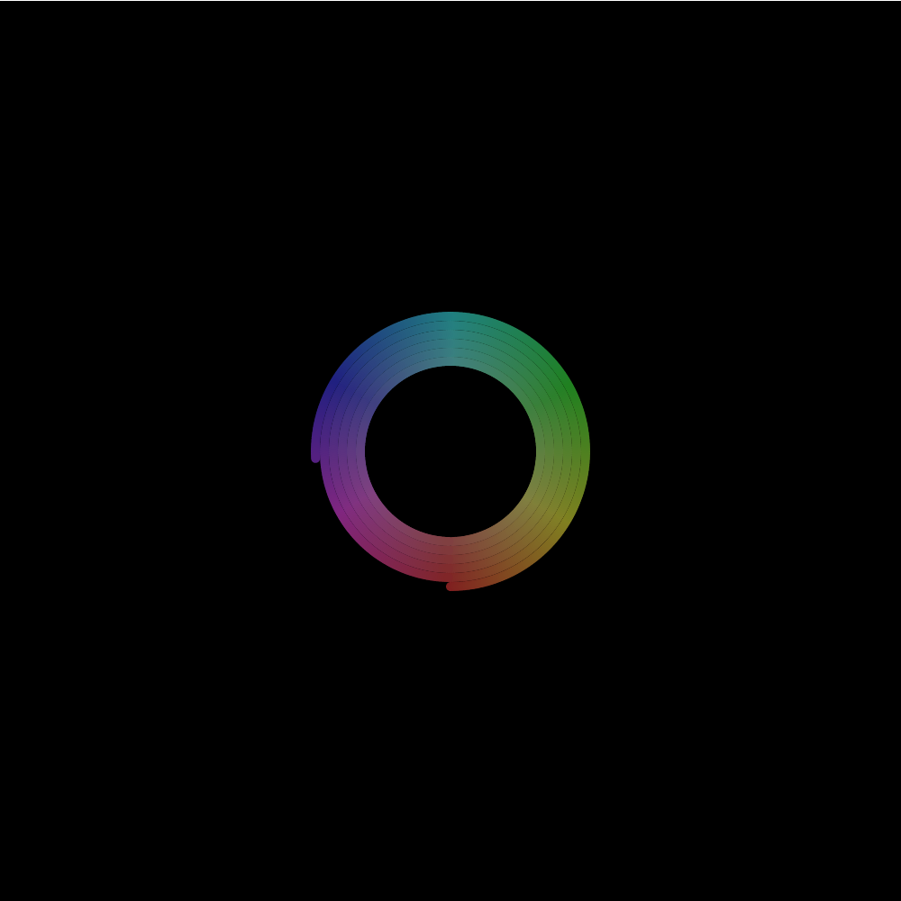

# Color Wheel

## (AI generated) Description

This p5.js sketch creates a dynamic visual effect that gradually fills the canvas with colorful dots arranged in a circular pattern. Here is a brief overview of its outcome:

- Initializes with a black background.
- Gradually changes the hue of the dots, creating a rainbow effect that cycles through all possible hues (0 to 360 degrees in HSB color mode).
- Increases the radius of the circular pattern incrementally until it reaches a certain threshold (`sat` variable adjustment).
- Positions the dots based on sine and cosine functions, resulting in a circular pattern that expands outward from the center of the canvas.
- Resets the hue after reaching the end of the spectrum (360 degrees) and increases the saturation every full cycle to expand the radius of the pattern.
- The brightness of the dots is kept constant.
- The final effect is a colorful spiral made up of dots that expands until the entire canvas is filled, restarting the hue cycle without clearing previous dots, creating a dense, multi-colored pattern over time.
