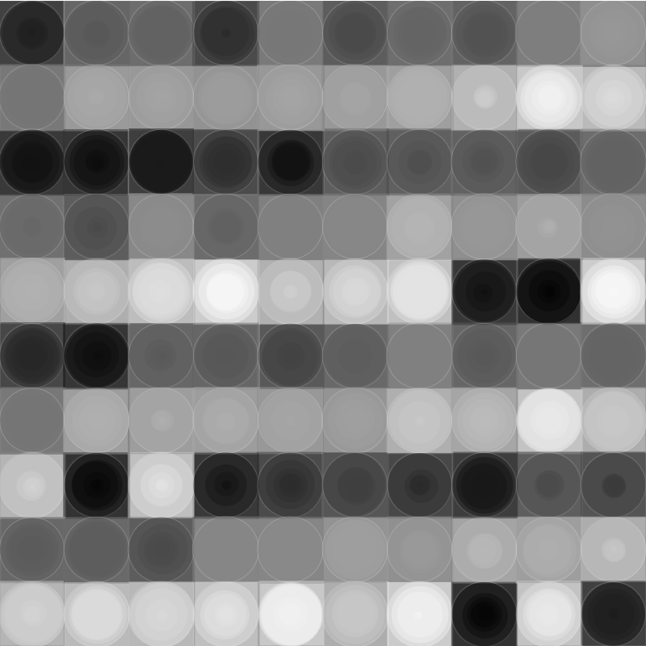

# Nested Loop Grid

## (AI generated) Description

The sketch generates a static 400x400 canvas with a pattern combining circles and squares in a grid layout, using p5.js.

- Background color is set to medium gray (`128`).
- Shapes are drawn in rows and columns across the canvas, covering it entirely.
- Each position in the grid initially hosts multiple circles with varying sizes, overlaid for depth, followed by two rectangles. Circles and rectangles have slightly random offsets to create a dynamic, somewhat organic appearance.
- The fill color for shapes gradually changes across the canvas thanks to the incrementing color variable, introducing a gradient-like effect. Opacity is set low (`100`) for semi-transparency.
- Additional circles with very thin white borders (`strokeWeight(0.5)`) and low opacity (`stroke(255,50)`) are also added to the mix, enhancing the visual complexity.
- No looped animation; `draw()` function is empty, making the visual output static post-initial drawing.
