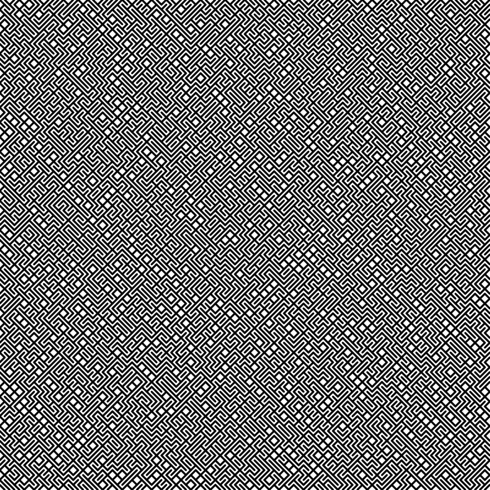

# 10 Print Goto 10

## (AI generated) Description

This p5js sketch generates a static grid of diagonal lines within a 500x500 pixel canvas. Each cell of the grid contains a single line, which can be either a forward slash (/) or a backslash (\), chosen randomly. The grid is created by iterating through the width and height of the canvas in steps of 5 pixels.

- Canvas size: 500x500 pixels
- Grid step size: 5 pixels
- Line orientation: Randomly chosen for each cell to be either `/` or `\`
- Line thickness: 2 pixel
